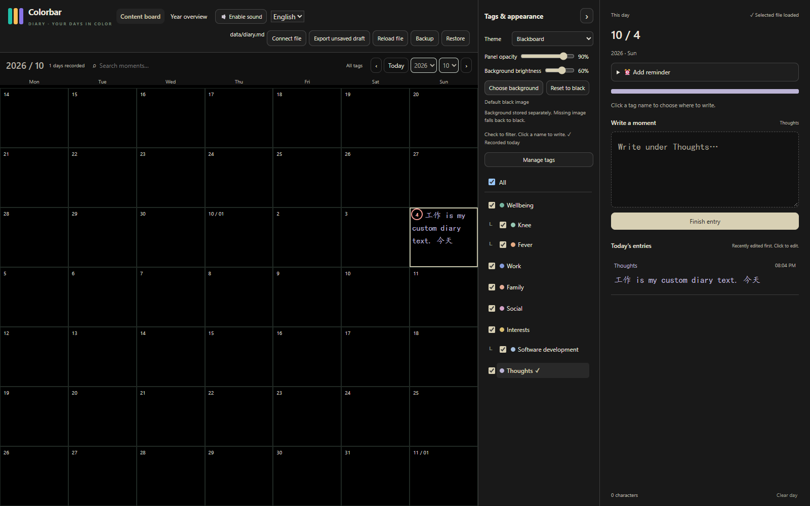
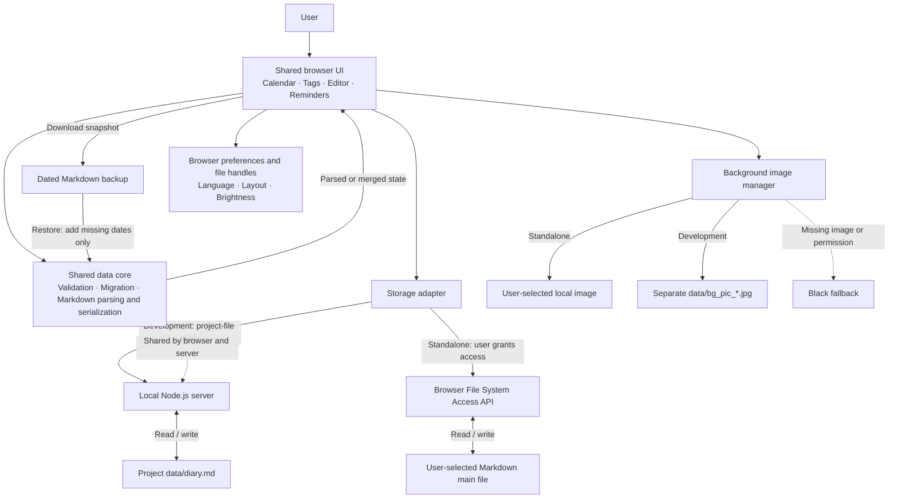
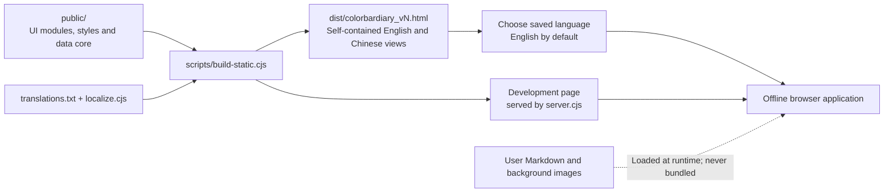

# Colorbar Diary

**One HTML interface. One Markdown diary.**

English | [简体中文](docs/README.zh-CN.md)

[Download v0.1.0](https://github.com/Liangxiuzuo/colorbar-diary/releases/tag/v0.1.0) · [Report an issue](https://github.com/Liangxiuzuo/colorbar-diary/issues)

Colorbar Diary brings your diary to life with just **one standalone HTML file for the visual interface and one Markdown file for all your diary content and structured diary data**. Open the HTML in a supported browser, connect your Markdown file, and start writing. No account, installation, external CDN, or server is required for standalone use.

Your Markdown file is the main data source—not a browser cache or a separate database. Keep it in a local folder or a cloud folder synchronized to your computer. You can replace the HTML when upgrading while keeping your diary file. Browser preferences are auxiliary; optional background photos and backups remain separate from the main diary.

Record small moments and see them together on a continuous calendar. Tags give each entry a color, while your writing stays in a file you control.



## Highlights

- **A continuous content board:** scroll through days, filter by tags, or switch to a multi-year overview.
- **Flexible daily entries:** write multiple entries under hierarchical tags, with custom colors and a five-face wellbeing rating.

## Quick start

### Use the standalone HTML

1. Download `colorbardiary_v0.1.0.html` from [GitHub Releases](https://github.com/Liangxiuzuo/colorbar-diary/releases/tag/v0.1.0) and open it in desktop **Chrome or Edge**. Source checkouts also contain the build named in [dist/releases.json](dist/releases.json).
2. Choose **New file** to create an empty Markdown diary, or **Choose file** to open an existing Colorbar Diary file.
3. Grant file access when prompted, select a day and tag, and start writing.
4. Check the save status. Use **Backup** to download a dated snapshot.

The first formal release is **v0.1.0**. Its downloadable file is named
`colorbardiary_v0.1.0.html`; automatic build numbers (such as v4) remain separate.
Run `npm run release:prepare` to produce the release HTML, quick-start guide,
license, build metadata, and SHA-256 checksums in `release/v0.1.0/`.

Node.js is not required for this mode. Direct file writes depend on browser support and your permission. Safari and mobile compatibility have not been certified for this package.

The language selector is available before connecting a file. Switching languages saves pending edits first, then reloads the interface. Diary text and custom tag names are never translated. Built-in tags have translated display labels; their stored definitions remain compatible with older diaries.

### Run the development server

Requires **Node.js 20 or later**. There are no runtime npm dependencies.

From the project directory:

```sh
npm start
```

Open [http://127.0.0.1:4327](http://127.0.0.1:4327). The server creates its own `data/diary.md` on first run. You can also connect a different Markdown file through the browser UI.

| Environment variable | Purpose | Default |
| --- | --- | --- |
| `PORT` | Local development port | `4327` |
| `COLORBAR_DATA_DIR` | Project data directory | `data/` beside `server.cjs` |

Keep a backup before using a development build with important entries. The local server binds to the loopback interface; it is intended for local use, not deployment as a public diary service.

## How files work

| Action | What happens |
| --- | --- |
| **Connect file** | Choose, create, or reconnect your Markdown main file. |
| **Export unsaved draft** | Download the current in-memory diary without replacing the main file. Useful when saving fails. |
| **Reload file** | Read external edits from the main file. Unsaved changes may be discarded after confirmation. |
| **Backup** | Download a complete dated Markdown snapshot. |
| **Restore** | Add dates absent from the current diary. Existing dates are skipped in full; this is not an overwrite or same-day merge. |

### Markdown is the main data source

The current archive format is **v4**, independently versioned from application builds. It contains a readable daily section and a structured recovery section. Preserve the recovery section: it stores tag relationships, timestamps, settings, and other information needed to reconstruct the diary.

For v4 files, edits to the supported daily Markdown structure can be read back using **Reload file**. This is a structured diary format, not a general-purpose importer for arbitrary Markdown documents. Newer builds retain readers for supported older diary formats.

Browser storage may remember file handles and interface preferences. Clearing browser storage does not delete the Markdown file: reconnect it to access your diary again. If the main file changes externally while you are editing, saving stops rather than silently overwriting the detected change. Export your draft, then reload and reconcile the content.

### Backgrounds stay separate

- In development mode, selected images are converted into separate `data/bg_pic_*.jpg` files.
- In standalone mode, the browser remembers an authorized local image handle when supported. Otherwise the image is available for the current session only.
- Missing images or unavailable permissions fall back to black.
- Background photos, language, layout, and brightness preferences are **not included in Markdown backups**. Diary appearance settings stored in the main file remain part of the archive.

## Architecture

The browser UI and local development server share the same validation and Markdown data core. Two storage paths support the same editing experience: direct access to a user-selected file, or the local server’s project file.



Editable Mermaid source: [docs/architecture.mmd](docs/architecture.mmd).

The diagram separates diary storage from optional background assets and browser preferences. User data is loaded at runtime and is never bundled into the downloadable HTML.

### Build and language flow



Editable Mermaid source: [docs/build-flow.mmd](docs/build-flow.mmd).

The build packs both language views into one HTML file. A small startup loader selects the saved language, defaulting to English. Translation applies to interface code and labels; it does not rewrite diary content or translate the Markdown schema. The development page uses the same renderer as the standalone build.

## Development and verification

```sh
npm test
npm run build:static
npm run audit
```

- `npm test` checks Markdown round trips, migration, validation, tag deletion, reminders, and archive handling using synthetic data.
- `npm run build:static` generates a self-contained HTML in `dist/`. Build numbers are local artifact revisions, not official release tags. Unchanged output does not create another revision.
- `npm run audit` checks the candidate publication paths and common private-path or credential patterns. It supplements manual review; it cannot prove that all sensitive content has been removed.

Optional browser checks:

```sh
npm install --no-save playwright
npx playwright install chromium
npm run test:ui
```

The UI test runs with a temporary data directory and checks English defaults, Chinese switching, file connection screens, and preservation of diary text. `BROWSER_PATH` can select an installed browser; `PLAYWRIGHT_MODULE` can override the module location. Do not use your real diary as a test fixture.

### Source map

| Path | Responsibility |
| --- | --- |
| `public/app.js` | Calendar, tags, editor, reminders, and save orchestration |
| `public/core.js`, `public/archive.js` | Validation, migration, Markdown serialization and parsing |
| `public/storage-browser.js` | Browser file access and development storage routing |
| `public/background.js` | Independent background image loading and brightness |
| `public/locale.js`, `public/translations.txt` | Language preference, built-in tag labels, and UI translations |
| `public/index.html`, `public/style.css` | Shared interface structure and styling |
| `server.cjs`, `core.cjs` | Local development server and Node data-core entry point |
| `scripts/build-static.cjs`, `scripts/localize.cjs` | Standalone packaging and build-time localization |
| `tests/` | Tests using synthetic data |
| `docs/` | Usage notes, screenshots, and Mermaid diagram sources |

Edit the source modules and rebuild, rather than hand-editing generated HTML. When changing architecture, update both the `.mmd` source and the matching README diagram.

## Current limitations

- Reminders require a running page and enabled audio. Closed pages, sleeping computers, and browser throttling can prevent timely alerts; missed reminders are not replayed.
- This is a local-first application, not a built-in cloud synchronization service. A synchronized folder can carry the Markdown file, but concurrent edits still need care.
- Diary files are plain text, not encrypted by the application.
- Browser file permissions and remembered handles may need to be granted again.
- Background image decoding depends on the browser. Animated images are not intended as animated backgrounds.

## Contributing and publication status

Bug reports should include the browser, application build, steps to reproduce, and a minimal **synthetic** example. Do not include real diary content, personal photos, credentials, or private file paths.

For changes, update the source, run the relevant checks, and document any data-format or compatibility implications. English and Chinese UI behavior should remain aligned.

See [CONTRIBUTING.md](CONTRIBUTING.md) for the contribution workflow,
[CHANGELOG.md](CHANGELOG.md) for changes, and [release validation](docs/release-v0.1.0.md)
for the publication status and verification scope.

## License

Licensed under the [MIT License](LICENSE). You may modify and distribute the
software, including your own personalized forks, under its terms.
